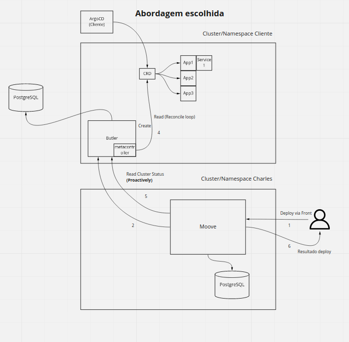

# 1. Record architecture decisions

Date: 2020-11-18

## Status

Accepted

## Context

We need to implement the operator pattern.

## Decision

The first accepted draft can be found on [miro](https://miro.com/app/board/o9J_kpu1Pis=/?moveToWidget=3074457351328925638&cot=14)


We will implement two Custom Resources, `CharlesDeployment` and `CharlesRoutes`.

Deployment example
```yaml
api: k8s.charles.io
kind: CharlesDeployment
metadata:
 labels:
  namespace: <namespace>
spec:
 circleId: <id-circle>
 deploymentId: <id-deployment>
 components:
  - name: quiz-app-backend
    tag: v1
    templateType: helm
    chart: http://github.com/quiz-app-backend/contents
  - name: quiz-app-front
    tag: v1
    templateType: helm
    chart: http://github.com/quiz-app-front/contents
```

Routes example
```yaml
apiVersion: charlescd.io/v1
kind: CharlesRoutes
metadata:
  name: default-routes
spec:
  circles:
    - id: first-circle
      default: true
      components:
        - name: quiz-app-backend
          tag: v1
        - name: quiz-app-frontend
          tag: v1
    - id: second-circle
      default: false
      components:
        - name: quiz-app-backend
          tag: v2
        - name: quiz-app-frontend
          tag: v2
```

Butler will only directly apply the CRDs to the cluster.
After butler has applied the `CharlesDeployment` on the first reconcile loop we compile the charts and store it on the database, all subsequent reconcile loops read the manifest from the database.

After Butler detects that all deployments are healthy it then applies the `CharlesRoutes` CRD
## Consequences

We will not use octopipe to apply the manifests.

Butler will only apply the CRD manifests.

Butler will only provide the desired state based on de received state from the cluster via metacontroller webhook and internal database state.
