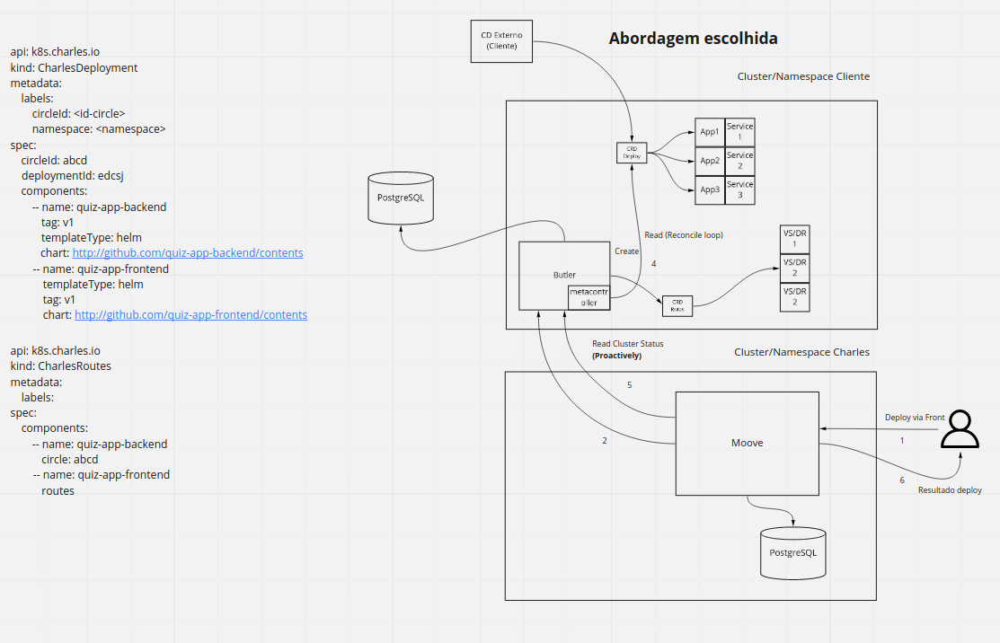

# 1. Record architecture decisions

Date: 2020-11-18

## Status

Accepted

## Context

We need to implement the operator pattern.

## Decision

The first accepted draft can be found on [miro](https://miro.com/app/board/o9J_kpu1Pis=/?moveToWidget=3074457351328925638&cot=14)

This version will not have the CRD, we will use the Metacontroller project to reconcile resources based on their labels and on butler database state.
We will have a new column on the v2deployments table to hold the compiled helm charts so we can have a reproducible snapshot of the deployment.
Idealy we will accept a github url containing the commit/branch identifier (as of today we can only download charts from master)

## Consequences

We will not use octopipe to apply the manifests.
Butler will not apply the manifests itself
Butler will only provide the desired state based on de received state from the cluster via metacontroller webhook and internal database state

In the future we plan to create a CRD to hold charles circles desired states so we can opt to use this CRD instead of our database to check for the desired state.
As a consequence we can easily integrate on any existing CD pipeline.
