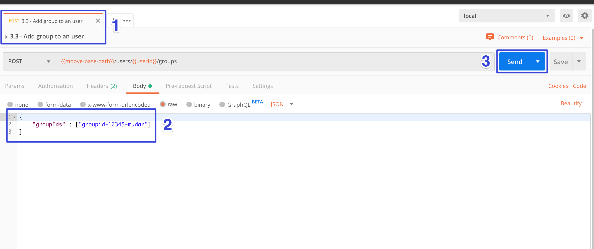

# 3 - Users

## 3.1 - Create user

1. Acesse a pasta Users da _collection_ _postman_ e selecione **"3.1 - Create user".**
2. Adicione os seus dados pessoais.
3. Submeta a requisição.

## 3.2 - Auth new User on Keycloak

1. Acesse a pasta Users da _collection_ _postman_ e selecione **"3.2 - Auth new user on keycloak".**
2. Informe os dados de login cadastrados no passo anterior.
3. Submeta a requisição.
4. Você deve receber um token de autenticação que deverá ser utilizado nas próximas requisições.
5. Na aba de testes o token será armazenado em uma variável de contexto **"token"**.

## 3.3 - Add group to an user

Para que o usuário cadastrado na sessão anterior tenha acesso ao sistema é necessário que você atribua um grupo de permissões a ele. Veja abaixo:

1. Acesse a pasta Users da 

   1. _collection_

    _postman_ e selecione **"3.3 - Add group to an user".**

2. Adicione o id do grupo cadastrado na sessão:  [2 - Groups](init-groups.md#2-2-create-group-all-permission) 
3. Submeta a requisição.

