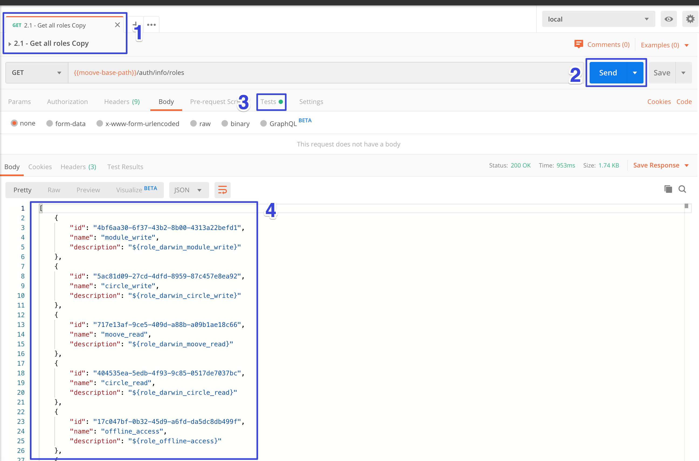

# 2 - Groups


O cadastro de grupos é aonde definimos todas as funcionalidades que os usuários vinculados ao grupo terão acesso ao logar no sistema.

Dessa forma cada funcionalidade no sistema, seja acessada através do menu principal, através de um botão, tem uma permissão relacionada no cadastro de grupos de usuários.


## 2.1 - Get all roles

Vamos recuperar os papeis que já existem no sistema para poder criar um novo grupo de acesso. Execute os passos abaixo:

1.  Acesse a pasta Groups da _Collection_ _postman_ e selecione **"2.1 - Get all roles".**
2. Submeta a requisição para obter os papeis já cadastrados.
3. O resultado dessa requisição é inserido em uma variável de contexto **"all-roles"** onde será utilizado no próximo passo para criar um grupo com todos os papeis. Você pode optar por criar um grupo utilizando apenas as funcionalidades desejadas copiando os _ids_ de retorno ao invés da variável de contexto.
4. Você deve visualizar o retorno da requisição com todas as funcionalidades.

## 2.2 - Create group All permission

Você pode criar um grupo com todas as permissões utilizando a variável preenchida no passo anterior. Ou selecionar penas os ids recuperados na consulta anterior. 

1. Acesse a pasta Groups da _Collection_ _postman_ e selecione **"2.2 - Create group All permission".**
2. Dê um nome para o grupo que irá cadastrar. A propriedade _roleIds_ pode ser preenchida com a variável de ambiente "**all roles**".
3. Submeta a requisição.

## 2.3 - Get all groups

Por ultimo verifique se seu novo grupo foi cadastrado executando a requisição abaixo:

1. Acesse a pasta Groups da _Collection_ _postman_ e selecione **"2.3 - Get all groups".**
2. Execute a requisição.
3. Verifique o retorno com todos os grupos.

