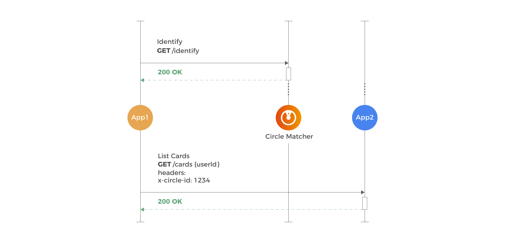

# Outras configurações dos círculos

## Como integrar círculos com serviços?

Uma vez detectado o ****[**círculo ao qual o usuário pertence**](https://app.gitbook.com/@zup-products/s/charles/v/v1.6/circulos/como-identificar-os-circulos), essa informação deve ser repassada para todas as próximas requisições através do parâmetro x-circle-id no header. Isso acontece porque o Charles detecta pelo ID do círculo para qual versão da aplicação uma determinada requisição deve ser encaminhada. Vejamos o exemplo abaixo:

Na prática, em algum momento durante a iteração do usuário com a sua aplicação \(App1\) - como no login, por exemplo - o `charles-circle-matcher` \(_Circle\_Matcher_\) **-** deverá ser acionado para obter o círculo. 

Com isso, o ID deve ser repassado como valor no parâmetro x-circle-id localizado no header da requisição das próximas chamadas \(App2\). O Charles é responsável por propagar essa informação que, quando recebida no Kubernetes, seja utilizada para redirecionar a requisição para a versão correspondente ao deploy realizado no círculo. 

Caso o x-circle-id não seja repassado, todas as requisições serão redirecionadas para versões de “Mar Aberto”, ou seja, para releases padrões das suas aplicações sem uma segmentação específica.  

### **Caso de mesclas de serviços com versões diferentes na minha release**

Para facilitar seu entendimento, vamos exemplificar com um um cenário onde a sua stack possui dois serviços: **Aplicação A** e **Aplicação B,** e os seus círculos devem fazer o uso das seguintes versões:

Sendo assim, a lógica de redirecionamento utilizando o x-circle-id será: 

1. O usuário envia no header: `x-circle-id=”Círculo QA”`. Nesse círculo, a chamada será redirecionada para a **versão X** do serviço **Aplicação A** e a **versão Y** do serviço **Aplicação B**. 
2. O usuário envia no header: `x-circle-id=”Circulo Dev”`. Nesse círculo, a chamada será redirecionada para a **versão Z** do serviço **Aplicação A e a versão Z** do serviço **Aplicação B.**                      

## Como rotear círculos com cluster de Kubernetes?

Para entendermos melhor como o **Charles** envolve o **Kubernetes** e o Istio no roteamento de tráfego, considere o seguinte cenário onde existem dois círculos:

* Moradores de Campinas \(identificado pelo ID 1234\);
* Moradores de Belo Horizonte \(identificado pelo ID 8746\).

Em ambos círculos foram implantadas releases do serviço chamado "application", entretanto com versões diferentes:

* Moradores de Campinas \(1234\): utiliza a versão v2.
* Moradores de Belo Horizonte \(8746\): utiliza a versão v3.

Além disso, existe uma versão default \(v1\) para usuários que não se encaixam em algum círculo específico.

Suponha que, ao realizar a requisição para identificação do usuário, seja retornado o id 8756. Com isso, essa informação deverá ser repassada nas próximas interações com serviços através do header x-circle-id. A imagem abaixo retrata como que, internamente, o Charles utiliza os recursos para rotear para a release correta:

Ao realizar a implantação de uma versão em um círculo, o Charles realiza todas as configurações para que o roteamento seja feito da maneira correta. Entretanto, para entender melhor como ele acontece, vamos utilizar um cenário onde uma requisição vem de um serviço fora da stack, como mostra na figura abaixo:

1. A requisição será recebida pela Ingress, que realiza o controle do tráfego para a malha de serviços. 
2. Uma vez permitida a entrada da requisição, o Virtual Service consulta o conjunto de regras de roteamento de tráfego a serem aplicadas no host endereçado. Nesse caso, a avaliação acontece através da especificação do header x-circle-id, de maneira que o tráfego corresponda ao serviço "application". 
3. Além do serviço, também é necessário saber qual subconjunto definido no registro. Essa verificação é feita no Destination Rules. 
4. O redirecionamento do tráfego é realizado com base nas informações anteriores, chegando então à versão do serviço.  

   Caso o x-circle-id não seja informado, existe uma regra definida no Virtual Service que irá encaminhar para a versão padrão \(v1\).

