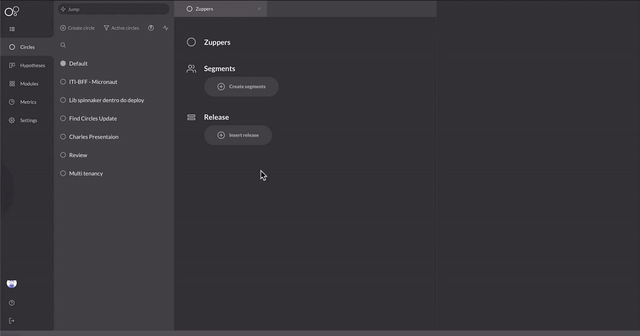

# Como segmentar e identificar os círculos?


As segmentações são um conjunto de características que você define para agrupar seus usuários nos círculos do Charles. 

É  possível segmentar seus usuários através do preenchimento de informações de **forma manual** ou por meio da **importação de um arquivo csv.**


Uma grande vantagem de utilizar as segmentações é porque, com elas, é possível fazer combinações lógicas entre vários atributos para criar diferentes tipos de públicos e, dessa forma, utilizá-los nos testes das hipóteses. Por exemplo, a partir da características “profissão” e “região”, pode-se criar um círculo de engenheiros da região norte, outro só com engenheiros do sudeste e um terceiro contendo todos os engenheiros do Brasil.

###  **Segmentação manual** 

Neste tipo de segmentação, você define as lógicas que o círculo deve seguir para compor um match com usuários que atendam às características pré-determinadas. 

Essas características podem ser definidas com base nas lógicas de: 

* Equal to
* Not Equal
* Lower Than
* Lower or equal to
* Higher than
* Higher or equal to
* Between
* Starts With

Isso significa que, ao setar na plataforma do Charles uma segmentação considerando um dessas variáveis acima, o sistema irá retornar com um círculo cuja base será composta por estes usuários. 

Vamos a alguns exemplos:




###  **Segmentação por csv**

Neste tipo de segmentação, é utilizada apenas a primeira coluna do csv para criar as regras. O único operador lógico suportado até o momento é o OR. 

Na prática, essa modalidade permite que você possa, por exemplo, extrair de uma database externa os IDs dos clientes com um perfil específico e importá-los direto na plataforma do Charles.


## Identificação dos círculos

Depois de segmentados os círculos, como você pode buscá-los dentro da plataforma do Charles? 


Se após a criação do círculo for necessária a utilização do Circle Matcher para testar suas regras de segmentação, você pode integrar nas suas aplicações o recurso Identify do módulo `charles-circle-matcher` para detectar os círculos aos quais  o seu usuário pertence.


Por exemplo, dada a utilização dos seguintes parâmetros ao segmentar:


  
Ao realizar a requisição de identificação com as seguintes informações, círculos compatíveis serão retornados:



Identify



Este endpoint identifica a quais círculos o usuário pertence 






Workspace's ID





NY



Lawyer 



46 



Stony Brook










```
{ 
    "circles": [ 
    { 
    "id": "6577ae92-648c-11ea-bc55-0242ac130003", "name": "NY Lawyers" 
},  { 
    "id": "6577b112-648c-11ea-bc55-0242ac130003", 
    "name": "Stony Brook's Citizens" 
    } 
  ] 
}
```





Como no nosso exemplo existem círculos correspondentes com as informações sobre o usuário, o charles-circle-matcher está retornando uma lista com eles. Neste caso, dois círculos se encaixaram: NY Lawyers e Stony Brook’s Citizens.

Nessa requisição, apenas o parâmetro x-application-id é obrigatório. O body é totalmente flexível, porém vale lembrar que as chaves devem ter a mesma nomenclatura definida nas regras de segmentação do círculo. Veja no caso a seguir:


\*\*\*\*

O círculo “Stony Brook’s Citizens” foi criado para a identificar usuários que tenham como característica a chave “city” e o exato valor “Stony Brook”. Sendo assim, ele não estará na listagem ao realizar uma requisição para o Identify caso seja informado o body como no exemplo abaixo. 


Quando o usuário não se enquadra em nenhuma segmentação, o sistema retorna indicando que ele se encaixa no “**Mar Aberto**”. 

O Mar Aberto, no contexto do Charles, é como **segmentação geral** que inclui todos os usuários que estão fora de um círculo específico


Uma boa prática é realizar essa identificação sempre que o usuário faz login na aplicação. Entretanto, isso pode ser alterado de acordo com a necessidade da sua regra de negócio.



Mar Aberto



Esta endpoint demonstra como aparece o Mar Aberto no Charles 






Workspace's ID 





46



Stony Brook







Listagem de todos os círculos aos quais o usuário pertence 


```
{
   "circles":  [
    {
       "id": 6577ae92-648c-11ea-bc55-0242ac130003", 
       "name": "NY Lawyers"
    },
    { 
       "id": 6577b1112-648c-11ea-bc55-0242ac30003",
       "name": "Stony Brook's Citizens"
    }
  ]
}   
```





