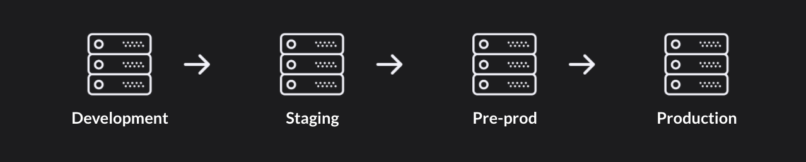

# Deploy em círculos x Outros deploys

## Deploy em círculos x Deploy tradicional 

Nos deploys tradicionais, é comum que a aplicação precise passar por diversos ambientes até chegar à produção. Já com o Charles, o sistema de deploys em círculos funciona somente em um ambiente de produção. A validação por release é fragmentada de acordo com os círculos selecionados, ou seja, você pode ir ampliando gradativamente o acesso à release a mais e mais círculos.

## Deploy em círculos x Blue-green deploys

No blue-green deployment, ou implantação azul-verde, são criados dois ambientes idênticos na infraestrutura, porém com diferentes versões de uma aplicação implantados em cada um. Dessa forma, é possível testar suas hipóteses que, uma vez confirmadas, podem migrar de uma versão para outra. 

O principal benefício desta técnica é que o downtime é zero, trazendo mais segurança para a transição. Apesar disso, o custo para o blue-green deployment é bastante elevado, já que demanda o dobro de infraestrutura para ser executado.

No caso do Charles, o deploy em círculos oferece ao time mais confiança e rapidez no lançamento de novas versões, com downtime zero e sem custos adicionais de infraestrutura. Além disso, é possível refinar através dos círculos quem serão os usuários que farão a validação da sua nova versão.

## Deploy em círculos x Canary releases

No canary release, ou implantação canário, é feita a publicação gradual da nova versão de um software a partir de um roteamento dentro da infraestrutura. À medida em que a versão é testada e se torna mais confiável, seu acesso é expandido a mais usuários da base.

Entretanto, essa técnica não propõe nenhuma estratégia de escolha de usuários para a expansão. Por esse motivo, torna-se mais difícil gerenciar as versões existentes do sistema, o que contribui para que você não opere com tanto versionamento e, assim, limite suas possibilidades de testar hipóteses.

No caso do Charles, a lógica de deploys em círculos segue um padrão parecido de mudança paralela. Isto significa que na plataforma você também começa liberando o acesso à release a um número reduzido de usuários e vai expandindo o acesso à medida que o sistema passa por testes.

O grande diferencial da plataforma é que, caso algum problema seja encontrado ou a hipótese já tenha sido validada, a reversão é realizada de forma simples: você pode retirar os usuários daquele círculo, realizar o deploy de outra versão para aquele grupo ou levar a versão da aplicação para mar aberto, isto é, para todos os clientes que não estão inseridos em um círculo dentro do Charles.

