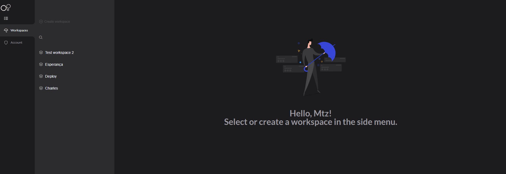

# Definindo um Workspace

O workspace permite que você segmente o uso do CharlesCD dentro da sua empresa ou do seu time. Com ele se define as **permissões personalizadas dos usuários**, o que garante mais segurança para o seu projeto.


Com apenas uma instalação, vários times podem utilizar o Charles com configurações distintas ou, se preferir, criar um workspace para representar diferentes ambientes de desenvolvimento como, por exemplo, homologação, produção, etc. 


Cada workspace possui as seguintes configurações:

* Definição dos acessos e [**permissões dos grupos de usuários**.](../../referencia/grupos-de-usuarios.md#permissoes-para-o-grupo-de-usuarios-no-workspace)
* Cadastros de credenciais do [**Docker Registry**](docker-registry.md), [**Git**](github.md) ****e de ****[**Continuous Deployment \(CD\)**](../../referencia/configuracao-cd.md).
* Personalização do [**Circle Matcher**](../../referencia/circle-matcher.md).
* Registro do [**Provedor de Métricas**](../../referencia/metricas/provedor-metrica.md) das suas aplicações.


A criação do workspace pode ser feita apenas pelo usuário **root**. Entretanto, o preenchimento das configurações podem também ser feitas pelos usuários associados ao workspace com perfil de **mantenedor**.


### Como obter o identificador do meu workspace?

Assim que seu workspace é criado, mesmo sem a definição das configurações, ele já possui um identificador único. 

Para obter essa informação, selecione o workspace desejado e, no menu à esquerda, clique em **Copy ID**:

