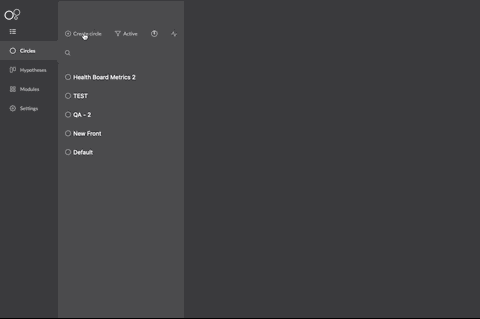

# Circles

Circles are the main approach related to the **new deploy concept** brought by Charles. It enables user groups creation with several characteristics and promotes simultaneous application tests for a great number of possible users.

Circles indicate clients segmentation and also support the version management created for a specific audience.

Once the right people are chosen to have access to your release associated to a circle, Charles will generate a [**series of business or performance metrics**](https://docs.charlescd.io/v/v0.2.1-en/reference/metrics). This information will give you better hypothesis results or even a better view on a feature in analysis and that will enable more assertive tests.

## Active and inactive circles

The existence of releases defines if a circle is active or not, which is the implemented versions for users segmentation. Therefore, active circles have implemented releases while the inactive circle doesn't have any.

## How to create circles?

To create a circle, you just have to follow these steps:

**1.** Click on Create Circle.  
**2.** Give a name to your circle.  
**3.** Define a segmentation.  
**4.** \[Optional\] Implement a release.

The segmentations are a subset of characteristics that you define to put all your users together in a circle. To make this happen, it is possible to segment your users by **filling in information manually** or through a **CVS file importation**.


**The best advantage to use segmentation** is the possibility to combine logic with several attributes to create different audience categories and, in this way, use them on hypothesis tests. For example, using the characteristics ‘profession’ and ‘region’, you are able to create a circle with engineers from the brazilian north region, another one with engineers from the southeast and a third one with all brazilian engineers.


### How to get an identifier in **circles**?

After you have created your circle, it already has a single identifier.

To get this information, select your **circle, default** and on the left menu, click on **Copy ID**, like the example below: 

### **Manual segmentation**

On this kind of segmentation, you define the logic the circle will follow to build a match with predetermined characteristics.

This characteristics can be defined based on the following logics:

* Equal to
* Not Equal
* Lower Than
* Lower or equal to
* Higher than
* Higher or equal to
* Between
* Starts With

Let’s see more examples:

### **Segmentation by CSV importation**

This segmentation is used only in the first CSV column to create rules. The first line in the first column must contain the key name and the same one must be informed on the key field.

After you have finished the file upload and saved the configuration, an overview will show up demonstrating how your segmentation is:

This way allows you to extract from an external client’s IDs base, a specific profile and import them directly on Charles.


OR is the only logic operator supported on this segmentation.


## How to integrate circle with services?

Once the **circle which the user belongs** to is detected, this information must be passed on to all next requests through the `x-circle-id` parameter on the header. Charles detects by the circle’s ID which application version a determined request must be forward. Let's see how it woks on example below:

At some point during the interaction of the user and your application **\(App1\)**, for example, the login - the **`Identify`** service of **`charles-circle-matcher`** - must be triggered to get the circle.

By that, the ID must be passed on as value in the **`x-circle-id`** parameter located on the header of all next requests of your services **\(`App2`\).** Charles is responsible to disseminate this information because when it's received on Kubernetes, it will be used to redirect the request to a corresponding release version associated with a circle.

If the **`x-circle-id`** is not passed on, all the requests will be redirected to **Default** versions, which means it will use the standard releases of your applications, without a specific segmentation.

### **Mix of services with different versions of my release**

We will give an example of a specific scenario where your environment has two services: **Application A** and **Application B** and your circles must use the following versions:

So, the redirect logic using **`x-circle-id`** will be:

1. The user sends to the header:  `x-circle-id="QA Circle"`. On this circle, the request will be redirect to a **X version** of the service on **Application A** and the **Y version** of the service on **Application B**. 
2. The user sends to the header:  `x-circle-id=”Dev Circle”`. On this circle, the request will be redirect to the **Z version** of the service on **Application A** and **Z version** of the service on **Application B.** 

## How to route your circles with Kubernetes Clusters?

**Charles** involves [**Kubernetes**](https://kubernetes.io/docs/home/) **\*\*and \[**Istio**\]\(**[https://istio.io/docs/](https://istio.io/docs/)**\) \*\***on traffic routing. Let's think about a scenario where there are two circles:

* Campinas residents \(identify by ID 1234\);
* Belo Horizonte's residents \(identify by ID 8746\).

Both circles were implemented with service releases called **'application'**, but with different versions:

* Campinas' residents \(1234\): version 2, v2.
* Belo Horizonte's residents \(8746\): version 3, v3.

Besides that, there is a default \(v1\) version for users that don't fit in any specific circle.

Let's supposed that, to make a request to identify a user, an ID 8756 is returned. This information will be passed by the next service interaction through the header `x-circle-id`. The image below shows how Charles uses the internal resources to route the correct release.

When performing a version implementation in a circle, Charles makes all the configuration so that the routing is correctly done. To understand better how this works, let's use a scenario where a request comes from a service outside the stack, see the image above.

The request will be received by Ingress, which performs all the routing control to the service mesh.

1. Once the request entry is allowed, Virtual Service inquiries the traffic routing rules to be applied on the addressed host. In this case, the evaluation happens through`x-circle-id` header specification, in a way that the traffic corresponds to the **application** service. 
2. Besides the service, it is also necessary to know which subset is defined on the register. This verification is made on **Destination rules**. 
3. The traffic redirect is peformed based on previous information, until it gets to the service version. 
4. If the `x-circle-id` is not informed, there is a rule defined by Virtual Service that will forward to the default version \(v1\). 

