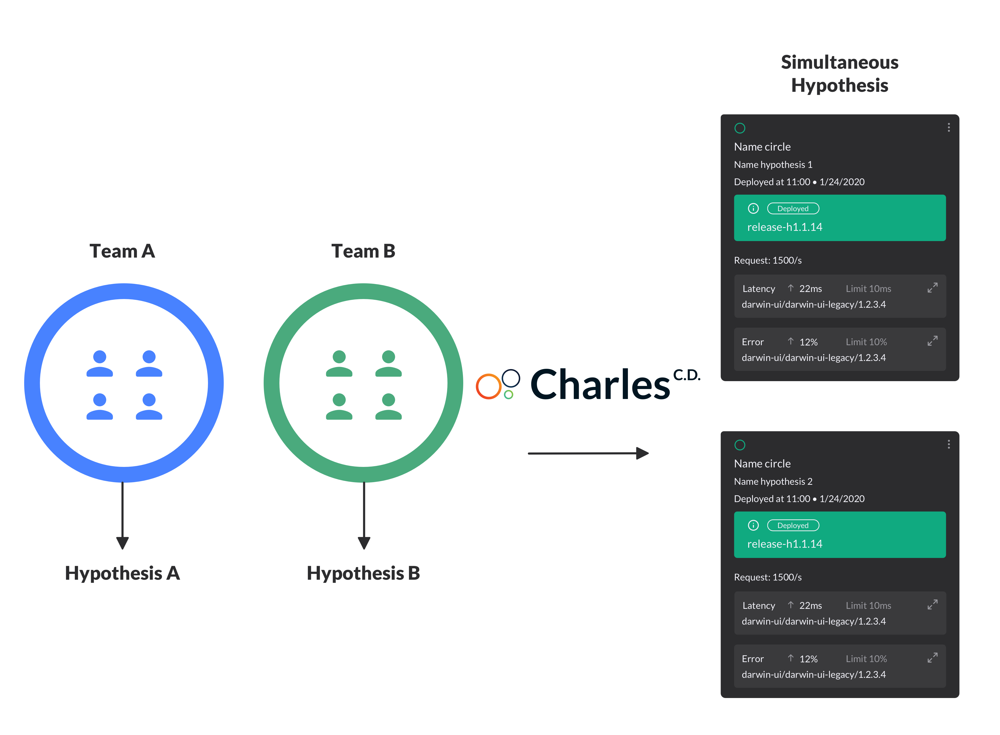

# Hypothesis

Hypothesis are **registered alternatives** on the platform to solve some issues or to validate changes of applications that you have integrated on CharlesCD. 

Its possible that one hypothesis may have one or more features that are directly related to modules or/and projects that were registered before in your workspace. 

Imagine a situation in which two teams work on the same product and have different ideas to raise the client conversion rate. Team A suggests adding a button on the page, meanwhile Team B believes that include a ‘selling suggestion’ box will be more assertive. 

Charles makes it possible for both teams to create different hypothesis, so each team is able to lead the development through a board that is automatically created and then they also can independently select different users circles to validate the results of each hypothesis. 

## How to create hypothesis?

When you register a hypothesis on Charles, your request will be forwarded to `charlescd-moove`. At the end of this process, the system will create a board and you will be able to manage and create release cards with the necessary actions to test all your hypothesis. 

There are two types of cards:

1. **Action:** cards that involve coding like the new features implementation or fixes on the project. 
2. **Feature:** cards that indicate an action to be done, for example, perform a field test with the users. 

When a feature card is added, Charles creates a new git branch for the client that is directly stored in the used SCM, Git or Bitbucket, for example. 

## Board management

The board is organized and structured based on Agile methodology, so you are able to create a backlog with tasks and prioritize what is going to be done \(to do\) and indicate which ones are in progress \(doing\).   
  
As the hypothesis development evolves, the tasks are moved on the moove column. The status for each activity are:

* **To Do:** tasks that are prioritized and need to be done;
* **Doing:** tasks in progress;
* **Ready to go:** finished tasks, if it is a feature card, it is possible to generate a build.
* **Builds:** all builds are generated here, after a combination with the features on the previous column. You can expand the cards to have more information. 

Charles is responsible to orchestrate the merges resolution, especially if several same modules cards appears, but with different git ramifications. 

After this process is finished and the codes are mixed, a new release ramification is created and the card state is changed to build.

* **Releases Deployed:** the cards on this column show where the hypothesis builds are implemented.

When a hypothesis is moved to the **Ready to Go** column, you indicate to the system that a specific card can go through a **Generate Release Candidate** process, which means the hypothesis will transform into a branch release of the master release on your git.   

