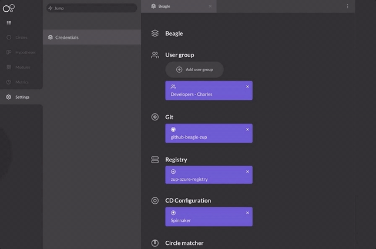

# Registering a metrics provider

The metrics provider register is an important step to use Charles with its full pontential, once that it allows you to quantify your applications performance and follow up their status. 


Before you register your provider, it is necessary to finish your [**metrics configuration**](https://www.google.com/url?hl=en&q=https://docs.charlescd.io/referencia-1/metricas/metrics%23configuracoes-das-metricas&sa=D&ust=1590687593934000&usg=AFQjCNH7spNPLmB_w_VCJUYiCVrNRYKr1g). 


Add your metrics provider in the Charles' configuration. You will find the steps below on how to configure this: 

1. Click on your name, on the botton left corner and then select **Settings**.;
2. Click on **Credentials;**
3. Click on **Add Metric Provider;**
4. Select your **tool option**;
5. Make the configuration based on the selected tool. 

