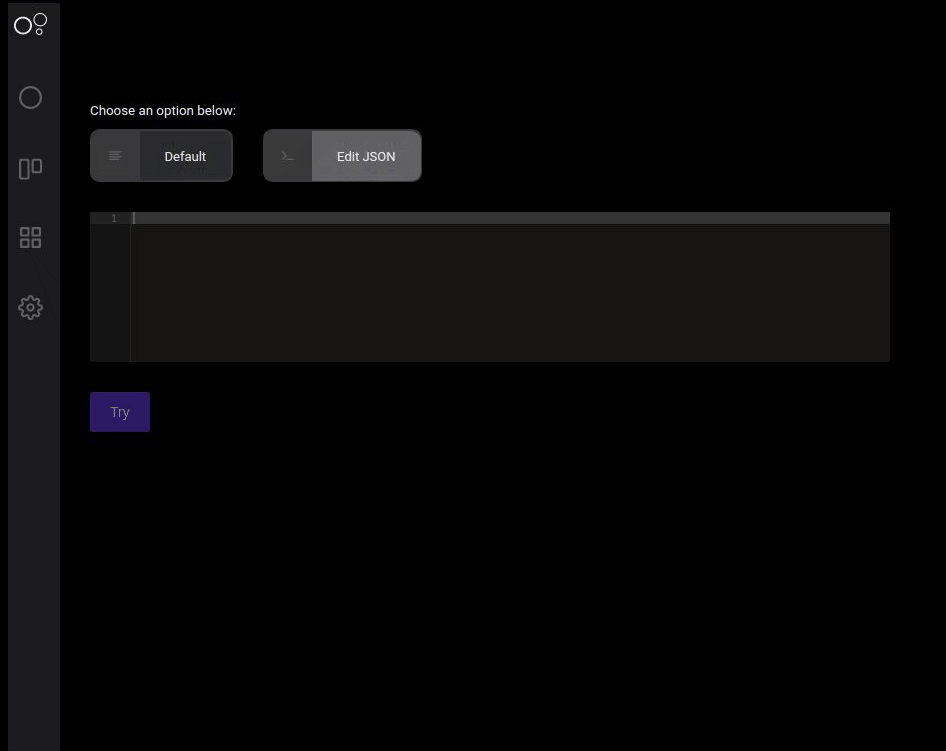

# Circle Matcher

O Circle Matcher é um recurso que permite você validar se os seus [**círculos**](https://docs.charlescd.io/referencia/circulos) estão com segmentações coerentes. Você também pode utilizá-lo em suas aplicações para determinar em qual círculo os seus usuários se encaixam.


Uma boa prática é realizar essa identificação sempre que o usuário faz login na aplicação. Porém, isso pode ser alterado de acordo com a necessidade da sua regra de negócio.


### Identificando círculos através do CharlesCD

Ao utilizar a interface é possível perceber que existem duas formas de realizar a identificação dos círculos. Para isto, acesse o menu **Circles** dentro de um **workspace** e selecione o ícone indicado abaixo: 


As duas formas de realizar essa validação são:

* **Default:** nessa opção, você adiciona manualmente chaves e valores que definem as características de um usuário de teste. E, com base nisso, ao executar o **Try**, você receberá todos os círculos que ele se encaixa.  


* **JSON:** é similar à opção anterior, só que aqui você pode copiar e colar no **campo de payload** um **JSON** do seu ambiente produtivo ao invés de adicionar manualmente.




Se você passar informações que estejam fora das condições lógicas configuradas nos círculos, o sistema irá retornar que aquele usuário está no círculo _Default_, ou seja, na versão padrão da sua aplicação.


## Identificação de círculos através da API

Você pode integrar nas suas aplicações o recurso **Identify** do módulo [`charle-circle-matcher`](https://github.com/ZupIT/charlescd/tree/master/circle-matcher) para detectar os círculos que o seu usuário pertence.

Por exemplo, dada a utilização dos seguintes parâmetros ao segmentar:


Ao realizar a requisição de identificação com as seguintes informações, círculos compatíveis serão retornados.



Identify



Método utilizado para identificar círculos, baseado em características de um usuário.






{ "state": "NY", "profession": "Lawyer", "age": 46, "city": "Stony Brook"



UUID










```
{
  "circles": [
    {
      "id": "6577ae92-648c-11ea-bc55-0242ac130003",
      "name": "NY Lawyers"
    },
    {
      "id": "6577b112-648c-11ea-bc55-0242ac130003",
      "name": "Stony Brook's Citizens"
    }
  ]
}
```





Como nesse exemplo existem círculos correspondentes com as informações sobre o usuário, o **`charlescd-circle-matcher`**retorna uma lista com eles. Aqui, dois círculos se encaixaram: NY Lawyers e Stony Brook’s Citizens.

Nessa requisição, apenas o parâmetro **`X-Workspace-Id`** é obrigatório. O corpo da requisição é totalmente flexível, porém vale lembrar que as chaves devem ter a mesma nomenclatura definida nas regras de segmentação do círculo. Veja no caso a seguir:


O círculo **Stony Brook’s Citizens** foi criado para a identificar usuários que tenham como característica a chave **`city`** e o exato valor **`Stony Brook`**. Sendo assim, ele não estará na listagem ao realizar uma requisição para o **`Identify`** caso seja informado o corpo da requisição como no exemplo abaixo:



Identify



Método utilizado para identificar círculos, baseado em características de um usuário.






{ "aGEee": 46, "city": "Stony Brook" }



UUID







Listagem de todos os círculos aos quais o usuário pertence 


```
{
  "circles": [
    {
      "id": "6577ae92-648c-11ea-bc55-0242ac130003",
      "name": "Default"
    }
  ]
}
```






