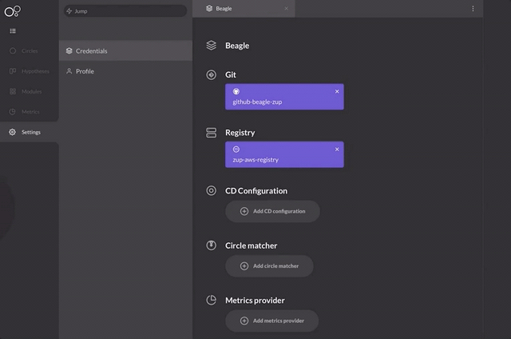

# CD Configuration

Durante a instalação do Charles, é necessário cadastrar um CD configuration vinculado ao seu docker. Para isso, basta realizar o seguinte passo a passo:

1. Clique no seu nome, no canto inferior esquerdo e, em seguida, selecione **Settings**.
2. Clique em **Credentials**. ****
3. Clique em **Add CD Configuration**. ****
4. Selecione as opções **Octopipe** ou **Spinnaker**, dependendo do sistema que utilize.
5. Defina um **nome** para o CD Configuration.
6. Defina um **namespace**.
7. Defina um **git provider**.
8. Insira o **token** do seu git. 
9. Por fim, selecione um **manager** para associar à CD Configuration. 

