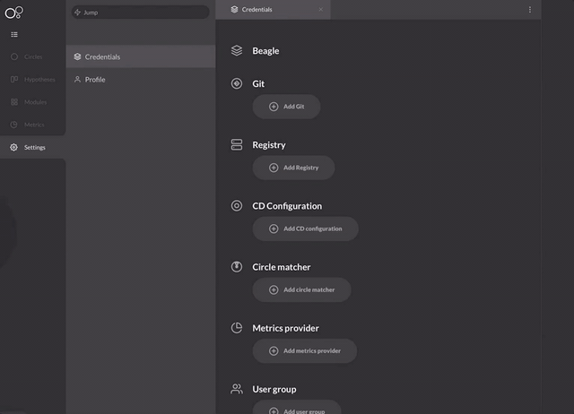

# Github

Durante a instalação do Charles, você pode adicionar o seu Git \(sistema de histórico e controle de versões\). Para isso, basta realizar o seguinte **passo a passo**: 

1. Clique no seu nome, no canto inferior esquerdo e, em seguida, selecione **Settings**
2. Clique em **Credentials** 
3. Clique em **Add Git** 
4. Selecione a opção de Git entre **GitHub** ou **GitLab 5**
5. Por fim, cole o link do seu git e ele será adicionado!                                       ****

