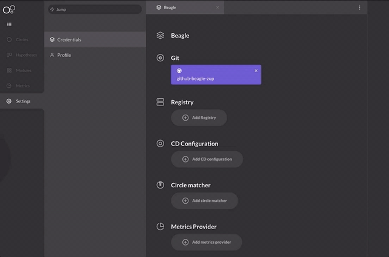

# Registry

**Durante a instalação do Charles, é necessário cadastrar um registry vinculado ao seu docker. Para isso, basta realizar o seguinte passo a passo:**

1. Clique no seu nome, no canto inferior esquerdo e, em seguida, selecione **Settings.**
2. Clique em **Credentials.** 
3. Clique em **Add Registry.**
4. Defina um **nome** para o Registry.
5. Defina para qual **cloud** você deseja vincular o Registry: AWS, AZURE, GCP ou STANDARD. 
6. Defina o **tipo de autorização:** Basic ou Bearer.
7. Digite a **URL** do seu registry
8. Na sequência, digite o **hostname.** Por fim, digite o seu username e senha. 

